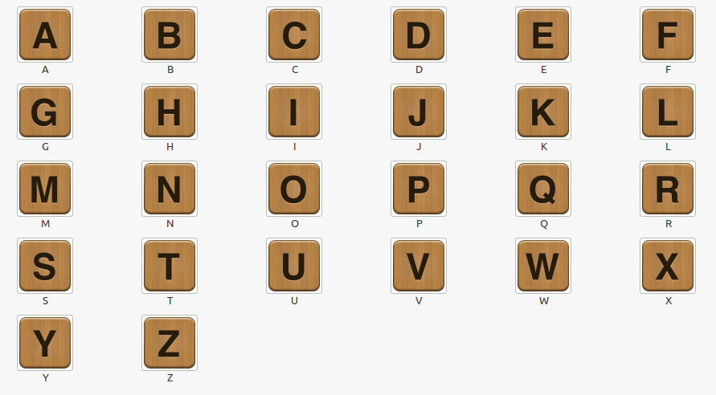
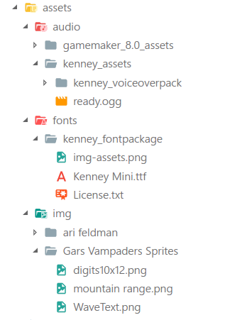

# The Clove Library for LÖVE

Clove is a useful LÖVE library using which you can easily (super-easily) loads huge amount of assets.
It also makes the process of requiring libraries super-easy. So two birds with one shot- libraries and assets!
And please note here asset means "images,fonts,sounds and videos"

## Table Of Contents

- [How to use Clove for asset loading?](#how-to-use-clove)
	- [A quick walkthrough](#a-quick-walkthrough)
	- [Load an arbitrary asset using Clove](#load-an-arbitrary-asset)	    
	- [Load all types of asset at once](#load-all-types-of-asset-at-once)
	- [Load specific type of assets](#load-specific-type-of-assets)
	- [The Master Function for importing Assets](#the-master-function-for-importing-assets)
- [How to use Clove for requiring libraries?](how-to-use-clove-for-requiring-libraries)
    - [Requiring non-returning libraries](#requiring-non-returning-libraries)
	- [Requiring all kinds of libraries](#requiring-all-kinds-of-libraries)
- [Auto-Correction Ability](#auto-correction-ability)
- [Aliases used in Clove](#aliases-used-in-clove)

## How to use Clove?

So how to use clove? First of all, since it's a module, require it:-
```lua
	clove=require 'clove'
```
Before we start looking at each function individually let's have a walkthrough of Clove - so you'd appreciate its capabilities and perhaps realise its limitations.

### A Quick Wakthrough

Let's for context say you want to create a typing game and you have a folder with the following sprites:-

<p align="center">
	<br/>
	<span style="align:center">Your folder of images (Credit- <a href="https://gameartguppy.com">GameArt Guppy</a>)</span>
</p>


So basically every file is named in the format "A.png", "B.png" and so on..

Now how would you load all this? Individually, right. Assuming you want all of them in a well organized format you would do something like this:-
```lua
	keyboardImages={}
	keyboardImages['a']=love.graphics.newImage("assets/a.png")
	-- ... and so on
```
And that would be **27 lines of code!!** just to load the assets But with Clove all you would do is:-

```lua
	keyboardImages=clove.importImages("assets")
```

And *that's it*!!! __27 lines of code versus 1 line of clove__. Which is better? You decide

> *But what if I have a "spritesheet" of keyboard images?* Then clove may not help you. But you could use [iffy](https://github.com/YoungNeer/iffy) for that task

### Load an arbitrary asset

Clove can even load an arbitrary asset- meaning you can load an individual asset without having to know what type of asset it is. An example might do good here:-

```lua
	asset=clove.loadAsset("audio.ogg")
```

And that would be the exact same as saying:-
```lua
	asset=love.audio.newSource("audio.ogg","static")
```

Now which one's better - you decide. 

> Now I'd like to point out here that `clove.importAsset` which is really just an alias of `clove.loadAsset`. For more information see [Aliases used in Clove](#aliases-in-clove)

Now let's get into detail. `clove.loadAsset` actually takes in *a number of* parameters, first ofcourse the URL of the asset and the rest are optional varargs. These varargs are plugged in the load function directly so if you wanted "stream" source instead of "static" then you just have to do this:-

```lua
	asset=clove.loadAsset("audio.ogg","stream") --same as the next line of code
	asset=love.audio.newSource("audio.ogg","stream")
```

And just to very clear here. It's not just for audio but for any type of asset - image, font, whatever. So for example the next two lines of code does the same thing

```lua
	font=clove.loadAsset("Kenney Mini",45)
	font=love.graphics.newFont("Kenney Mini.ttf",45)
```

And yes that's not a typo - you could write "font" instead of "font.ttf" or "font.otf" and that'd be just thing - just note one thing that there's a priority list - like png then jpg then ttf, *et cetera, et cetera* (look at source FMI).

### Load up all the assets at once

`clove.importAll()` will load up all the assets from images to sound to font to videos - everything will be imported and wrapped up in a table that it's gonna return.

Let's start with a simple example.

Let's say you have a directory structure like this:-


<br/>

You bet with such a complicated directory structure (directories within directories and their long and unfriendly names) importing the assets manually is really going to be a pain in the neck but with Clove it's not-
```lua
	gAssets=clove.importAll('assets',true)
```

And really that's it. For proof-of-concept, here's the entire code from [example 2](https://github.com/YoungNeer/lovelib/clove/blob/master/Examples/example%202)
```lua
clove=require 'clove'
gAssets=clove.importAll("assets",true)

gAssets['ready']:play()

function love.draw()
	love.graphics.draw(gAssets['mountain range'])
	love.graphics.setFont(gAssets['Kenney Mini'])
	love.graphics.print("Hello World")
end
```

You may already have realised from where these keys come from. They are just the extension removed version of the filename. Now let's understand what we did-

We first required clove which is trivial and then we used the importAll function and passed the path where all our assets reside (you could see the directory structure for proof) and in the second parameter we passed in true. We'll get to this in a moment but what this does is bascially says to clove- "Hey Clove check for assets in the sub-directories as well" and clove does just that. You must be careful when setting it to true because filenames could be same and if the are then the asset that was loaded first will be overridden by the one that was loaded later - and you bet it can cause problems. So please check if asset names are not the same *in any directory*

Now let's look at the function prototype of `clove.importAll`:- (ignore what's under <>)

```html
<table> clove.importAll(<string> path, <boolean> recurse, <function> rename, <function> except, ... )
```

Let's break down what each parameter means:-

 Parameter Name| Description
---------------|------------------
    path       | the directory to look up for images, note that *its the only mandatory argument*
	recurse    | whether to keep looking for images in the sub-directories
	rename     | a function which takes in a filename and returns the key string
	except     | a function which takes in a filename and returns a boolean for whether the asset should be added or not
	....       | varargs for more control


Now many other functions like `clove.importImages`,`clove.importFonts`,etc are going to follow the same modus operandi so let's take a close hard-look at the parameters.

`path` and `recurse` are trivial. The varargs are something we have already looked at (at [this](#load-an-arbitrary-asset) section). So the odd-ones are `rename` and `except`

If you remember from [example 2](https://github.com/YoungNeer/lovelib/clove/blob/master/Examples/example%202), the key-names were not exactly the filenames. For instance for asset `grass.png` the key would be `grass`. And if you wish you could make the key identical to the filename - just pass in an empty function as the third parameter! So basically the default value for `rename` is a function which takes in a filename and returns filename minus the extension. 

Now for context let's say you have assets - with everything in weird case (like "aNImAge.pNg") so accessing keys like `gImages['aNImAge']` is going to be very difficult and so you want all in lower-case. Well the way you'd do it is very simple. Just make a function that takes in a string and returns the lower-case of it and pass that function as `rename` i.e. as the third parameter and that'd do the task. Just for proof-of-concept here's what it would look like:- 

```lua
	clove.importAll(
		"images", -- assuming path is "images"
		false,    -- assuming we only want the images in the main directory
		function(filename) return filename:reverse() end
	)
```

Now you may access the image like `gImages['animage']` instead of `gImages['aNImAGE']` (*assuming the filename is aNImAGE and not aNImAGE.png - since we didn't remove the extension from the file) And if you want `gImages['anImage']` then you'll perhaps have to get particular - like checking if the file name is 'aNImAGE' and then returning 'anImage' if it is. Hope you get the idea.

Before we move on to `except` I'd like to point out the problem with the default rename method- By default as you know it removes the extension from the file-name making it more easier to type. But this could cause problems in some cases- let's say you have two files 'grass.png' and grass.jpg'. With the default rename function you will have either one of these files mapped on to the 'grass' key - meaning you would *lose* assets these way. So the solution to this - if you think it's a problem - is: simply pass in an empty function in `rename`. That way you'll have a unique key - 'grass.png' and 'grass.jpg' in our context.

Now about `except` - by default it's an empty function which returns *false* in all cases. Basically this decides which file should be included and which shouldn't be. Say you want 'grass.png' (and all other images) but you donot want 'background.png' then what you migh do is return true if the file name (BTW if i didn't already mention it - the function takes in a filename as an argument similar to `rename` callback function) is "background.png" and return *false* in all other cases. And note false means that the file *will be included* because as the name of the parameter suggests - include all files `except` *this* one. A proof-of-concept might make things easier

```lua
	clove.importAll(
		"images",
		false,
		nil,  -- use the default function for rename
		function(filename) return filename=="background.png" and true or false end
	)
```

### Load specific type of assets

So `clove.importAll` imports all types of assets - but what if you wanted only images, or only sounds - a specific type of asset in general. Worry not you have a bunch of functions that work the same as `clove.importAll` only difference being what's already stated here. So in a quick glance the functions are:-

```lua
clove.importFonts()     -- loads fonts only
clove.importGraphics()  -- loads images only
clove.importAudio()     -- loads sounds only
clove.importVideo()     -- loads videos only
```

> A note here that they have the exact same parameters as `clove.importAll`

### The Master Function for importing Assets

"Okay so I could load images and graphics specifically - but what if I wanted to load specific formats like png, ogg, ttf etc?" Well one way is that you would work around with the except parameter in either `clove.importAll` or the specific ones (and combine them). But that's a lot of work- so a quick solution to this is - *use the master function* - `clove.load` which takes in one extra parameter and that being the filetypes. This parameter is the first parameter and so the other parameters are shifted by one. A proof-of-concept is mandatory here I guess:-

```lua
	assets=clove.load({"png","jpg","ttf"},"assets")  -- assets is the main directory
```

Now `assets` table contains the images with the file-format "png" or "jpg" as well as fonts of the format "ttf".

> Please note that only those extensions are supported which are supported by LÖVE for eg. gif is supported but svg is not

## How to use Clove for requiring libraries?

Until now we have been loading assets but Clove is not all about that. It can also make the process of requiring libraries easier. And we'll just see how

### Requiring non-returning libraries

An example of non-returning library is [iTable](https://github.com/YoungNeer/lovelib/blob/master/itable) created by yours truly. For context iTable simply adds some global functions like table.merge,table.copy,etc. It doesn't return a table or anything. So for requiring such libraries as a whole I recommend you simply use `clove.require`. 

```lua
	clove.require('lib')  -- please note here that lib is a directory of libraries
```

It has almost the same arg-list as `clove.importAll` so the above should make sense immediately. So note that by almost I mean the `rename` parameter is gone cause there is no table so there is no key to be mapped to. Also there are no var-args. So just to be precise here- this is the prototype for `clove.require`. 

```html
<nil> clove.require(<string> path, <boolean> recurse, <function> except)
```

> Note that the `except` parameter works exactly as `clove.importAll` and `recurse` too is the same

### Requiring all kinds of libraries

Most LÖVE libraries are - as a matter of fact - returning i.e. they return something - a table in *most* cases. And so most of the time you'll have a lib folder which has either all returning libraries or some returning some non-returning. Even in such cases Clove might help you - provided the order in which the libraries load is not an issue.

So for requiring all kinds of libraries we will use `clove.requireLib` - which (we'll later come to know) is actually a genericised version of `clove.require` in that it returns a table of libraries - just like `clove.importAll` returned a table of assets. `clove.requireLib` re-introduces the `rename` parameter and the arg-list is very similar to `clove.importAll` - the only difference being that there are no varargs in `clove.requireLib`. So basically you'd use it like this:-

```lua
	allMyLibraries=clove.requireLib('lib')  -- assuming lib is a directory of libraries
```

Let's say you had Anima and autoCursor in the lib folder, then you'd access them like allMyLibraries['Anima'] and allMyLibraries['autoCursor'].

Now at this point I'd be honest with you - there's an extra parameter in `clove.requireLib` (in addition to `except`) and that is `simple`. I'd recommend you don't touch it - it just lets clove know whether or not are you requiring only 'non-returning' (termed as *simple*) libraries. If it's true then no table is created and returned - thus allocating no extra memory. BTW if you set it to true then it'd be the same as `clove.require`. To end this section this is the prototype for `clove.requireLib`:-

```html
	<table> clove.requireLib(<string> p, <boolean> r, <function> r, <function> e, <boolean> simple)
```

> Some parameter names are reduced to their initials so that you don't see that ugly scrollbar!

## Auto-correction Ability 

I wanted to keep this seperate but since I talked about it in the ending of the [this](#load-an-arbitrary-asset) section so please look up there. Sorry for being lazy

## Aliases in Clove

Well I wanted to make it a detailed section but since I dont' have much time as of now I can only copy-paste from the source

```lua
	clove.import=clove.load
	clove.importAsset=clove.loadAsset
	clove.importAll=clove.loadAll
	clove.importFonts=clove.loadFonts
	clove.importGraphics=clove.loadImages
	clove.importAudio=clove.loadSounds
	clove.loadAudio=clove.loadSounds
	clove.loadSprites=clove.loadImages
```
